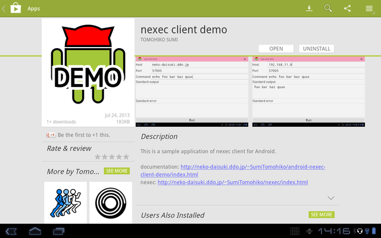
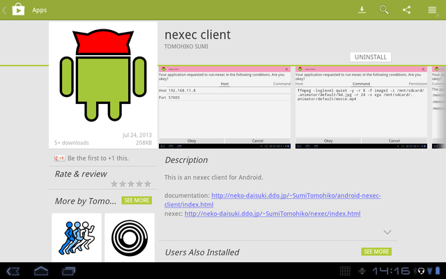

nexec client demo for Android
*****************************

.. figure:: icon.png
    :align: center

.. contents:: Table of contents

Overview
========

This is an nexec_ client application for Android.

.. _nexec: http://neko-daisuki.ddo.jp/~SumiTomohiko/nexec/index.html

nexec_ is a system to transfer system call requests via network. System calls
which an application in a server requested are transfered to a client machine.
The client machine performs the request, then it responses the result of the
system call.

.. figure:: nexec.png
    :align: center

    System call request and response

With this mechanism, you can use applications in a server as same as these in
your Android tablet. For example, if you execute Python_ in a server, the Python
process can read/write files in your tablet. As a result, the Python process can
run scripts in your tablet. You will find that Python looks in your tablet.

.. _Python: http://www.python.org/

.. figure:: python.png
    :align: center

    Python in a server

.. figure:: python_looks_in_your_tablet.png
    :align: center

    You will find that Python looks in your tablet.

Of cource, this application keeps your tablet secure. Applications in a server
cannot read/write files which you did not allow.

.. figure:: your_tablet_is_kept_secure.png
    :align: center

    Your tablet is kept secure.

.. note::
    Strictly speaking, the above explanation is a little wrong. The nexec_
    client application for Android is `nexec client for Android`__, which is
    implemented as a service. This application is one of user applications of
    that service. Furthermore, the system to transfer system call requests is
    fsyscall_. nexec_ is one usage of fsyscall_.

.. __: http://neko-daisuki.ddo.jp/~SumiTomohiko/android-nexec-client/index.html
.. _fsyscall: http://neko-daisuki.ddo.jp/~SumiTomohiko/fsyscall/index.html

Screenshots
===========

.. figure:: host_page-thumb.png
    :align: center
    :target: host_page.png

    Host page

.. figure:: command_page-thumb.png
    :align: center
    :target: command_page.png

    Command page

.. figure:: environment_page-thumb.png
    :align: center
    :target: environment_page.png

    Environment variables page

.. figure:: permission_page-thumb.png
    :align: center
    :target: permission_page.png

    Permission page

.. figure:: run_page-thumb.png
    :align: center
    :target: run_page.png

    Run page

.. figure:: select_a_preset-thumb.png
    :align: center
    :target: select_a_preset.png

    Select a preset dialog

.. figure:: give_a_preset_name-thumb.png
    :align: center
    :target: give_a_preset_name.png

    Give a preset name dialog

How to install
==============

This application is available at `Google play`_. Additionaly,
`nexec client for Android`_ is required. It provides a core service for nexec_.

    Google play page of this application

    Google play page of nexec client for Android

.. _Google play: https://play.google.com/store/apps/details?id=jp.gr.java_conf.neko_daisuki.android.nexec.client.demo
.. _nexec client for Android: https://play.google.com/store/apps/details?id=jp.gr.java_conf.neko_daisuki.android.nexec.client

How to use
==========

Tutorials
---------

The best way to know usage is reading tutorials. There are two tutorials.

The first one is on the most simple command, echo. This tutorial explains very
basic usages, such as how to connect with a server, how to execute a command and
how to see standard output.

Another tutorial is using Python. This tutorial also describes the same things
as that in the echo tutorial for readers to know all only with reading this
tutorial (There are some duplicated descriptions). Moreover, this tutorial
explains how to give environment variables and how to allow a process to
read/write files in your tablet.

The following links lead you to these pages.

1. `echo`__
2. `Python`__

.. __: tutorial/echo/index.html
.. __: tutorial/python/index.html

Anything else
=============

* License: `The MIT license`_
* GitHub repository: https://github.com/SumiTomohiko/android-nexec-client-demo
* Author: `Tomohiko Sumi`_

.. _The MIT license:
    https://github.com/SumiTomohiko/android-nexec-client-demo/blob/master/COPYING.rst#mit-license
.. _Tomohiko Sumi: http://neko-daisuki.ddo.jp/~SumiTomohiko/index.html

.. vim: tabstop=4 shiftwidth=4 expandtab softtabstop=4
