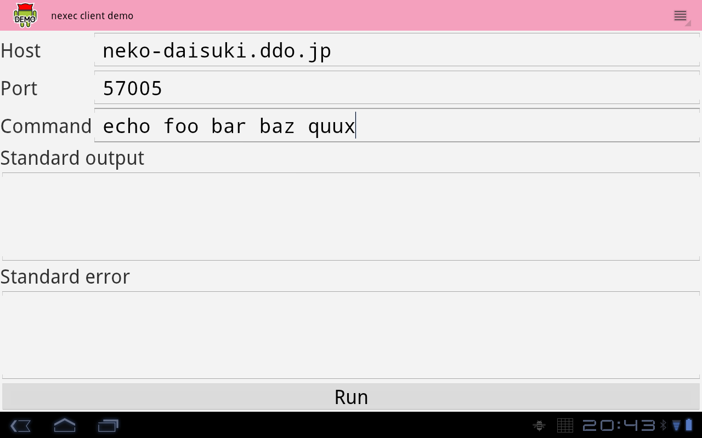
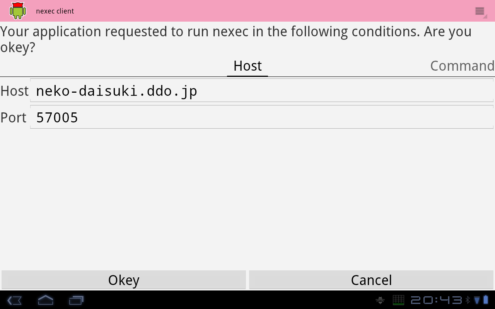

nexec client demo for Android
*****************************

This is an application to try `nexec client for Android`.

.. _nexec client for Andnroid:
    http://neko-daisuki.ddo.jp/~SumiTomohiko/nexec/index.html

How to use
==========

You must give this screen with the following three settings.

* Name of the server
* Port number of the server
* Command with arguments

When you finished, please push "Run". Then, android-nexec-client will show the
requests of this demo application.

If you push "Okey" to accept the requests, the demo application will connect
with the server to run the command. If the command outputs stdout/stderr, you
will see these in the textboxes.

.. image:: stdout.png

.. vim: tabstop=4 shiftwidth=4 expandtab softtabstop=4
